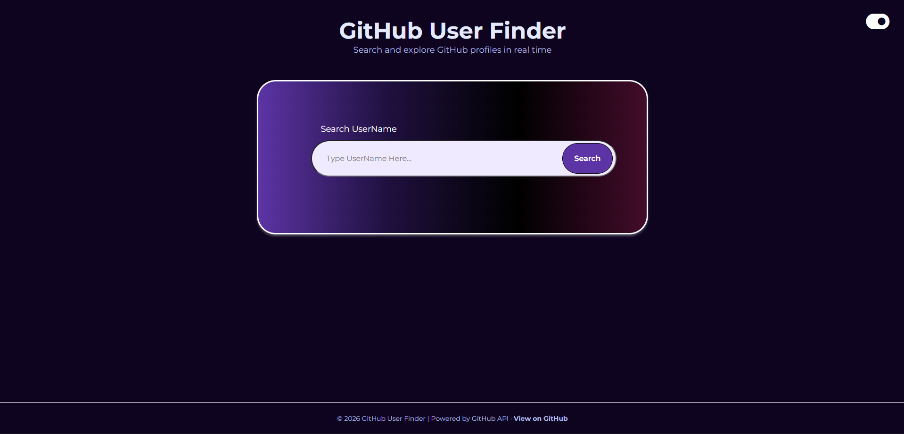

# GitHub User Finder 🔍

A responsive web app to search GitHub profiles in real time using the GitHub REST API. Displays key profile info, 5 latest repositories, and supports dark/light mode.

---

 <!-- Add demo.png or a GIF to your repo for best effect -->

## 🚀 Features

- **Search any GitHub user by username**
- **Profile details:**
  - Name, Bio
  - Followers & Following
  - Public repositories count
  - Blog, Company, Location
  - Account creation & last update date
- **5 most recently updated repositories**
- **Dark / Light theme toggle**
- **Search using Enter key**
- **Robust error handling:**
  - Empty input
  - User not found (404)
  - API rate limit exceeded (403)
  - Network/server errors
- **Fully responsive** (mobile, tablet, desktop)

---

## 🛠 Tech Stack

- HTML5
- CSS3 (custom responsive layout, gradients, animations)
- Vanilla JavaScript (ES6+)
- GitHub REST API
- Font Awesome (icons)
- Google Fonts (Montserrat & Poppins)

---

## 📦 Project Structure

```
├── index.html      # App structure & layout
├── style.css       # Styling, themes & responsiveness
├── script.js       # API logic, DOM manipulation, state handling
└── README.md
```

---

## 📖 Usage

- Enter a GitHub username and press Enter or click Search.
- Toggle dark/light mode using the button in the header.
- View profile details and 5 latest repositories.
- Errors and API limits are shown as alerts.

---

## ⚙️ How It Works

- User enters a GitHub username
- App calls:
  - `GET https://api.github.com/users/{username}`
  - `GET https://api.github.com/users/{username}/repos`
- Profile data is rendered dynamically
- Repositories are sorted by last updated
- Errors are caught and shown clearly to the user
- UI state updates without page reload

---

## 🔐 API Rate Limiting

- Uses GitHub’s public API (unauthenticated)
- **Rate limit:** 60 requests/hour
- If exceeded, app shows:
  > “API rate limit exceeded. Please wait a few minutes and try again.”
- _Future improvement:_ Add GitHub token authentication to increase rate limits.

---

## 🧪 Known Limitations

- No pagination for repositories (only latest 5)
- No authentication (public API only)
- No caching (repeated searches re-hit API)
- No debounce on search input

_These are intentional scope limits, not bugs._

---

## 📈 Possible Enhancements

- Repository sorting options (stars, forks)
- Pagination / “Load more” repos
- Token-based authenticated requests
- Skeleton loaders
- LocalStorage caching
- User comparison feature

---

## 👤 Author

**Prithwish Pal**  
GitHub: [@Prithwish2025](https://github.com/Prithwish2025)

---

## 📄 License

This project is open-source and available under the MIT License.